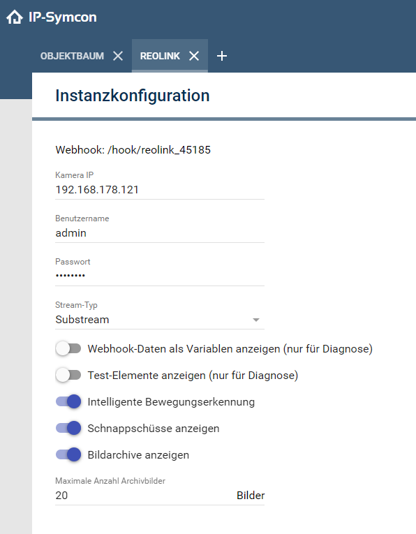

# Reolink für IP-Symcon

### Inhaltsverzeichnis

1. [Funktionsumfang](#1-funktionsumfang)
2. [Voraussetzungen](#2-voraussetzungen)
3. [Software-Installation](#3-software-installation)
4. [Einrichten der Instanzen in IP-Symcon](#4-einrichten-der-instanzen-in-ip-symcon)
5. [Statusvariablen und Profile](#5-statusvariablen-und-profile)
6. [WebFront](#6-webfront)
7. [Webhook](#7-webhook)
8. [Versionen](#8-versionen)

### 1. Funktionsumfang

Integration von Reolink-Kameras in IP Symcon.
Bei Verwendung mehrerer Reolink-Kameras kann das Modul kann mehrmals 
Dies ist kein ONVIF-Fähiges Modul.
Der Hauptnutzen dieses Moduls ist es, die intelligente Bewegungserennung für Personen, Tiere und Fahrzeuge zu nutzen, was über ONVIF aktuell nicht funktioniert.
Dieses Modul ist nur für Reolink Kameras ausgelegt, welche Webhhook unterstützen. 
Daher ist immer die aktuellste Firmware aufzuspielen.

Das Modul kann folgendes:

- Schnappschüsse bei Bewegungen aufnehmen (Allgemeine Bewegungen, Personen, Tiere und Fahrezeuge).
- Ein Schnappschuss-Archiv zu den jeweiligen Bewegungen erstellen und die Anzahl der darin gespeicherten Bilder definieren.
- Die intelligente Bewegungserkennung als Variable darstellen.
- Den Pfad zum RTSP-Stream erstellen, um das Live-Bild darzustellen.
- Auswählen, ob Main- oder Substream angezigt werden soll.

Das Modul kann nicht:
- Alle Reolink-Kameras abdecken
- Einstellungen an der Kamerakonfiguration vornehmen

Aktuell getestete Reolink-Kameras:
- Reolink Duo 2

Wenn eine Kamera mit dem Modul funktioniert, benötige ich eine Info mit Angabe des Kameramodells. 
Ebenfalls natürlich eine Sequenz Debug. 
Eventuell kann ich die Kamera dann ins Modul integrieren.

### 2. Voraussetzungen

- IP-Symcon ab Version 7.0

### 3. Software-Installation

* Über den Module Store kann das Modul unter dem genauen Namen gefunden und installiert werden.

### 4. Einrichten der Instanzen in IP-Symcon

- Unter 'Instanz hinzufügen' kann das 'Reolink'-Modul mithilfe des Schnellfilters gefunden werden.  
- Weitere Informationen zum Hinzufügen von Instanzen in der [Dokumentation der Instanzen](https://www.symcon.de/service/dokumentation/konzepte/instanzen/#Instanz_hinzufügen)

__Konfigurationsseite__:

Name     | Beschreibung
-------- | ------------------
Webhook                             |	Hier wird der verwendete Webhook angezeigt. Diesen in der Kamerakonfiguration eintragen
IP-Adresse                          |	IP-Adresse der Kamera
Benutzername                        |   Benutzername zur Anmeldung im Interface der Kamera
Passwort                            |   Passwort zur Anmeldung im Interface der Kamera
Stream-Typ                          |   Standard ist Substream. Hier kann zwischen Main- und Substream gewählt werden. Achtung: Der Mainstream ist häufig H265 codiert, dies kann von IP-Symcon nicht abgespielt werden.
Webhook-Daten                       |	Aktiviert die Anzeige der Variablen aus dem JSON des Webhooks. Dies ist nur für allfällige Tests und Diagnose nötig
Test-Elemnte anzeigen               |   Aktiviert die Anzeige der Elemente wie Bildarchiv, Schnappschuss und Varaible, um mit der Tesfunktion des Webhook aus dem Kamerainterface zu arbeiten. Dies ist nur für allfällige Tests und Diagnose erforderlich.
Intelligente Bewegungserkennung     |   Aktiviert die intelligente Bewegungserkennung
Schnappschüsse anzeigen             |   Aktiviert den letzen Schnappschuss der intelligenten Bewegungserkennung zur allfälligen Weiterverabeitung. Solange noch kein Schnappschuss erstellt ist wird nichts angezeigt
Bildarchive anzeigen                |   Aktiviert die Bildarchive. Diese kann in der Visualisierung angezeigt werden.
Anzahl Archivbilder                 |   Standard ist 20. Maximale Anzahl der Archivbilder. Nicht zuviele Bilder einstellen, da diese alle in IP-Symcon gespeichert werden.

### 5. Statusvariablen und Profile

Die Statusvariablen/Kategorien werden automatisch angelegt. Das Löschen einzelner kann zu Fehlfunktionen führen.

#### Statusvariablen

Es werden Variablen/Typen je nach Wahl im Konfigurationsformular erstellt.

#### Profile

Es werden keine Profile erstellt

### 6. WebFront

Integration von Kamerastream, Variablen zur intelligenten Bewegungserkennung und Bildarchiv.

### 7. Webhook

Es wird automatisch ein Webhook erstellt. Der Name des Webhook wird oben im Konfiguratinsformular angezeigt. Dieser Pfad muss im Webinterface der Kamera in den Einstellungen unter Push eingetragen werden. 
Es ist nur noch die IPvonSYMCON:3777 davor aufzuführen.
Beispiel: http://192.168.178.48:3777/hook/reolink_28009

### 8. Versionen

Version 1.0 (16.11.2024)

- Initiale Version
